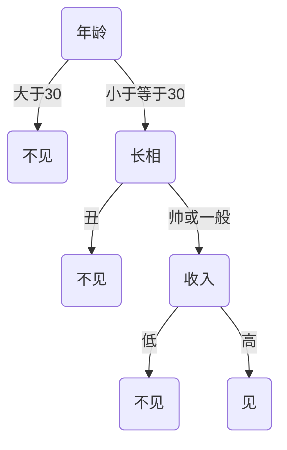
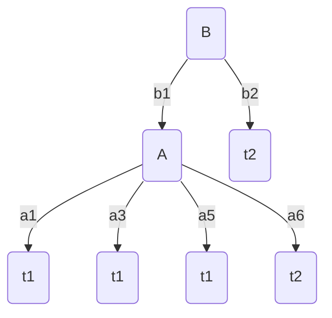
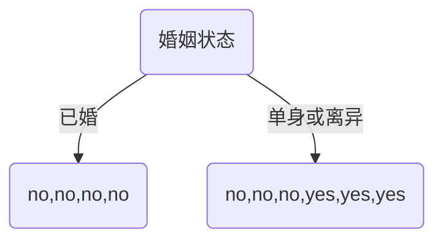

# 1. 决策树简介
决策树是一种树形结构  
树中每个内部节点表示一个特征上的判断,每个分支代表一个判断结果的输出,每个叶子节点代表一种分类结果

举例：  


## 1.1 决策树算法基本思想
通过特征的判断，将数据集一步步划分成更小、更纯的子集，直到达到某个停止条件。  

## 1.2 决策树构建步骤
决策树的建立过程  
1.特征选择:选取有较强分类能力的特征。常用的方法有**信息增益(ID3)，增益率(C4.5)，基尼指数(CART)**  
2.决策树生成:根据选择的特征划分数据集生成决策树。  
3.停止条件：当满足以下条件之一时，停止递归：当前节点的数据全部属于同一类别。没有更多特征可以划分。达到预设的树深度或样本数量限制。  
4.决策树也易过拟合,采用**剪枝**的方法缓解过拟合。  

# 2. 信息增益(ID3)决策树
## 2.1 信息熵
熵 Entropy :信息论中代表随机变量不确定度的度量  
熵越大,数据的不确定性度越高,信息就越多  
熵越小,数据的不确定性越低  

**计算公式：**  
$信息熵H(x) = -\sum_{i=1}^{n}分类占比P(xi)*log_2(分类占比P(xi))$

eg：ABCDEFGH   
则总体的信息熵 = 3/8*8 = 3  


## 2.2 信息增益
**概念**  
特征a对训练数据集D的信息增益**g(D,a)**,定义为集合D的熵H(D)与特征a给定条件下D的熵H(D|a)之差。  
即信息增益 = 熵 - 条件熵   

**数学公式**  
$g(D,A) = H(D)-H(D|A)$  

H(D|A) 为条件熵  
  
**条件熵计算公式**  
$H(D|A) = \sum_{v=1}^{K}\frac{D^{v}}{D}H(D^{v})$

K：分类数目

**举例说明**   
| 特征A | 特征B |label |
| - | - | - |
| a1 | b1 | A |
| a1 | b2 | A |
| a1 | b2 | A |
| a1 | b2 | B |
| a2 | b2 | B |
| a2 | b2 | B |

**计算特征A的信息增益：**  
对于所有样本AAABBB的熵为：   
$-(1/2)*log_2(1/2)*2 = 1$  
  
则对于数据AAAB的熵为：   
$-(3/4)*log_2(3/4) -(1/4)*log_2(1/4) = 0.81$    
  
对于数据BB的熵为：  
$ -(1)*log_2(1) = 0$   
  
对于特征A的**条件熵**为：  
$(4/6)*0.81 + (2/6)*0 = 0.54$   
  
对于特征A的信息增益为：   
$全部样本熵 - 对于特征A的条件熵 = 1-0.54 = 0.46$  

**计算特征B的信息增益：**  
同理可得0.1908

**综上所述：**  
特征A对分类的贡献更大，第一步应该选择特征A作为划分节点。

## 2.3 ID3决策树构建流程
1. 计算每个特征的信息增益   
2. 使用**信息增益最大的特征**将数据集拆分为子集  
3. 使用该特征（信息增益最大的特征）作为决策树的一个节点  
4. 使用剩余特征对子集重复上述 (1, 2, 3) 过程  

# 3. 增益率(C4.5)决策树
## 3.1 信息增益率
$某特征的信息增益率 = 某特征的信息增益*\frac{1}{某特征的特征熵} = \frac{Gain(D,A)}{IV(A)}$  

Gain(D,A):特征A的信息增益   
IV(A):特征A的特征熵   
  
**惩罚系数**：   $\frac{1}{某特征的特征熵}$   
  
**特征熵**：只对该列特征求信息熵   
举例：已知6个样本AAABBB，根据特征A,可以将数据划分为AAAB,BB。  
其中特征值为a1的label为AAAB,特征值为a2的label为BB。
则特征A的特征熵为  $-2/3*log_2(2/3) - 1/3*log_2(1/3)$   

## 3.2 举例说明
已知如下特征和标签：  
|特征A | 特征B| 标签|
| - | - | - |
|a1 |b1 |t1 |
|a2 |b2 |t2 |
|a3 |b1 |t1 |
|a4 |b2 |t2 |
|a5 |b1 |t1 |
|a6 |b1 |t2 |

**则特征A的信息增益** = ？ 
$ = (H(D)-H(D|A)) * (1/特征A的特征熵)$   
$ = (-\frac{1}{2}*log_2(\frac{1}{2})*2  -  (-\frac{1}{6}*log_2(\frac{1}{1})*6))  *  \frac{1}{-\frac{1}{6}*log_2\frac{1}{6}*6}  =  0.387$

**特征B的信息增益** = ？
$ = (H(D)-H(D|A)) * (1/特征B的特征熵)$
$ = (-\frac{1}{2}*log_2(\frac{1}{2})*2  -  \frac{2}{3}(-\frac{1}{4}log_2\frac{1}{4}-\frac{3}{4}log_2\frac{3}{4})-\frac{1}{3}(-1*log_2\frac{1}{1}))  *  \frac{1}{-\frac{2}{3}*log_2\frac{2}{3} -\frac{1}{3}*log_2\frac{1}{3}}  =  0.5$  

**综上**  
选择特征B作为第一个分类节点   



# 4. CART(基尼指数)决策树-分类
采用基尼指数最小化策略进行分类  
无论是回归还是分类，CART 树是一种二叉树结构，也就是说，每个节点最多只能有两个子节点。它通过不断对数据进行二分划分，最终形成一棵树，用于预测目标变量的值。

## 4.1 基本思想
1）递归划分数据集：每次选择一个特征和一个划分点，将数据集分成两个子集。
2）计算划分后的**基尼指数**：选择使基尼指数最小的划分。
3）递归终止条件：
        当前子集样本数小于某个阈值。
        当前子集的基尼指数小于某个阈值（即纯度足够高）。
        达到最大树深度。
4）叶子节点输出类别：通常是**该子集的多数类别**。

## 4.1 基尼值
基尼值（Gini Index）用于衡量一个数据集的不确定性或混乱程度。  
**基尼值越小，表示数据集越“纯净”**，即大部分样本属于同一类别。  

**公式**  
$Gini(D) = 1 - \sum_{k=1}^{K}P_k^2$  

K:类别总数   
$p_k$   :类别k在数据集D上的占比  
**举例**  
|是否有房 |婚姻状况 |年收入 |是否拖欠贷款 |
| - | - | - | - |
|y |single |125 |n |
|n |married |100 |n |
|n |single |70 |n |
|y |married |120 |n |
|n |divorced |95 |y |
|n |married |60 |n |
|y |divorced |220 |n |
|n |single |85 |y |
|n |married |75 |n |
|n |single |90 |y |  

$Gini(有房) = 1- (\frac{0}{3})^2 - (\frac{3}{3})^2 = 0$  
  
$Gini(无房) = 1- (\frac{3}{7})^2 - (\frac{4}{7})^2 = 0.4898$  

$Gini(single或divorced) = 1-(\frac{3}{6})^2 - (\frac{3}{6})^2 = 0.5$  

$Gini(married) = 1-(\frac{0}{4})^2 - (\frac{4}{4})^2 = 0$   

## 4.2 基尼指数
### 4.2.1 含义:    
基尼指数是用于特征划分时的指标，表示在某个特征划分后，数据集的基尼值加权平均后的结果。  
**基尼指数越小，说明该特征对分类的帮助越大。**   

### 4.2.2 **基尼指数计算公式**   
$Gini(D,A) = \sum_{v=1}^{V}\frac{|D^v|}{|D|}*Gini(D^v)$  

A:某个特征  
v:特征A的某个取值   
$D^v$   :特征A取值为v的子集  
$|D^v|$   是  子集$D^v$  的样本数量  
$|D|$   是  总样本数量  

## 4.3 **举例：房产、婚姻、年收入和贷款的CART分类**  
数据同上，  

**计算是否有房的基尼值和基尼指数**    
$GiniIndex(D,是否有房) = 0.3*0 + 0.7*0.4898 = 0.343$  
  
**计算婚姻状态的基尼值和基尼指数： 存疑**  
$GiniIndex(D,是否已婚) = 0.4*0 + 0.6*0.5 = 0.3$  
$GiniIndex(D,是否单身) = 0.367$  
$GiniIndex(D,是否离异) = 0.4$  
综上：婚姻状态特征的基尼指数为0.3  分裂点为(married),(single,divorced)

**计算年收入的基尼值和基尼指数：**  
首先根据收入排序得到结果如下：  
|年收入 |是否拖欠贷款 |
| - | - |
| 60| n|
| 70| n|
| 75| n|
| 85| y|
| 90| y|
| 95| y|
| 100| n|
| 120| n|
| 125| n|
| 220| n|

我们分别计算相邻值的中值的Gini指数，得到结果如下：   
Gini(D,65) = 0.4  
Gini(D,72.5) = 0.375   
...  
Gini(D,97.5) = 0.3  
...
Gini(D,172.5) = 0.4  
综上，**收入特征的基尼指数为0.3**，分裂点为(小于172.5),(大于172.5)   


继续对(no,no,no,yes,yes,yes) 这部分数据重新按照收入和住房特征计算最小基尼指数，并重新划分。  
依次循环。  
  
## 4.4 cart树构建的特征选择方法

## 4.5 举例：泰坦尼克号生还者预测
**测试代码**  
```python
import matplotlib.pyplot as plt
import pandas as pd
from sklearn.metrics import classification_report
from sklearn.model_selection import train_test_split
from sklearn.tree import DecisionTreeClassifier
from sklearn.tree import plot_tree


def train_model():
    titanic_df = pd.read_csv("./dataset/Titanic-Dataset.csv")
    print("titanic_df.head():\n", titanic_df.head(), "\n")
    print("titanic_df.info():")
    titanic_df.info()
    print("\n")

    # 1. 数据基本处理
    # 1.1 确定x和y
    x = titanic_df[['Pclass', 'Age', 'Sex']]
    y = titanic_df['Survived']
    # 1.2 缺失值处理
    x = x.copy()
    x['Age'] = x['Age'].fillna(x['Age'].mean())
    # 1.3 dumpy
    x = pd.get_dummies(x, columns=['Sex'])
    x.drop(['Sex_male'], axis=1, inplace=True)
    # 1.4 划分测试集与训练集
    x_train, x_test, y_train, y_test = train_test_split(x, y, test_size=0.2, random_state=23)

    # 2. 特征工程

    # 3. 训练model
    model = DecisionTreeClassifier(max_depth=10)
    model.fit(x_train, y_train)
    # 4. 预测
    y_pred = model.predict(x_test)
    # 5.评估
    print('classification_report:\n', classification_report(y_true=y_test, y_pred=y_pred), '\n')
    # 6. 绘制决策树
    plt.figure(figsize=(20, 30))
    plot_tree(model, filled=True, max_depth=10)
    plt.show()


if __name__ == '__main__':
    train_model()

```

**测试结果**   
```text
titanic_df.head():
    PassengerId  Survived  Pclass  ...     Fare Cabin  Embarked
0            1         0       3  ...   7.2500   NaN         S
1            2         1       1  ...  71.2833   C85         C
2            3         1       3  ...   7.9250   NaN         S
3            4         1       1  ...  53.1000  C123         S
4            5         0       3  ...   8.0500   NaN         S

[5 rows x 12 columns] 

titanic_df.info():
<class 'pandas.core.frame.DataFrame'>
RangeIndex: 891 entries, 0 to 890
Data columns (total 12 columns):
 #   Column       Non-Null Count  Dtype  
---  ------       --------------  -----  
 0   PassengerId  891 non-null    int64  
 1   Survived     891 non-null    int64  
 2   Pclass       891 non-null    int64  
 3   Name         891 non-null    object 
 4   Sex          891 non-null    object 
 5   Age          714 non-null    float64
 6   SibSp        891 non-null    int64  
 7   Parch        891 non-null    int64  
 8   Ticket       891 non-null    object 
 9   Fare         891 non-null    float64
 10  Cabin        204 non-null    object 
 11  Embarked     889 non-null    object 
dtypes: float64(2), int64(5), object(5)
memory usage: 83.7+ KB


classification_report:
               precision    recall  f1-score   support

           0       0.80      0.88      0.84       115
           1       0.74      0.61      0.67        64

    accuracy                           0.78       179
   macro avg       0.77      0.74      0.75       179
weighted avg       0.78      0.78      0.78       179
```

# 5. CART决策树-回归
采用平方误差最小化策略进行回归  
## 5.1 基本思想
1)递归划分数据集：每次选择一个特征和一个划分点，将数据集分成两个子集。  
2)计算划分后的**平方误差（MSE）**：选择使 MSE 最小的划分。  
3)递归终止条件： 
    当前子集样本数小于某个阈值。  
    当前子集的 MSE 小于某个阈值。  
    达到最大树深度。  
4)叶子节点输出值：通常是**该子集的目标值的平均值**。  

## 5.2 决策树分类和回归的区别
- CART 分类树预测输出的是一个**离散值**，CART 回归树预测输出的是一个**连续值**  
- CART 分类树使用**基尼指数**作为划分、构建树的依据，CART 回归树使用**平方损失**  
- 分类树使用叶子节点**多数**类别作为预测类别，回归树则采用叶子节点里**均值**作为预测输出  

## 5.3 CART回归树的平方损失(MSE平方误差)
$Loss(y,f(x)) = (f(x)-y)^2$  
y:真实值  
f(x):预测值  

## 5.4 案例：
|x|y|
|--|--|
|1|5.56|
|2|5.7|
|3|5.91|
|4|6.4|
|5|6.8|
|6|7.05|
|7|8.9|
|8|8.7|
|9|9|
|10|9.05|

对这10个数据如何构造cart树？  
x特征取均值作为划分点：1.5,2.5,3.5,4.5,5.5,6.5,7.5,8.5,9.5  

**划分点1.5的平方损失？**  
$大于划分点的均值 = (5.7+5.91+6.4+6.8+7.05+8.9+8.7+9+9.05)/9 = 7.5$
$(5.56-5.56)^2 + (5.7-7.5)^2+(5.91-7.5)^2+(6.4-7.5)^2+(6.8-7.5)^2+(7.05-7.5)^2+(8.9-7.5)^2+(8.7-7.5)^2+(9-7.5)^2+(9.05-7.5)^2 = 15.72$  

**以此类推，**  
|u	|1.5|	2.5|	3.5|	4.5|	5.5|	6.5|	7.5|	8.5|	9.5|
|--|--|--|--|--|--|--|--|--|--|
|m(s)|	15.72|	12.07|	8.36|	5.78|	3.91|	1.93|	8.01|	11.73|	15.74|

**综上所述，6.5作为第一个划分点**   

以此类推，在左侧6个中找到下一个划分点， 在右侧4个中找到下一个划分点，循环  
## 5.5 案例代码
**测试**  
```python
from sklearn.linear_model import LinearRegression
from sklearn.tree import DecisionTreeRegressor
import pandas as pd
import numpy as np
import matplotlib.pyplot as plt

# 准备数据
x_train = np.array(list(range(1, 11))).reshape(-1, 1)
y_train = np.array([5.56, 5.7, 5.91, 6.4, 6.8, 7.05, 8.9, 8.7, 9, 9.05]).reshape(-1, 1)
# print(y_train)

# 数据预处理

# 特征工程

# 模型训练
model1 = LinearRegression()
model2 = DecisionTreeRegressor(max_depth=1)
model3 = DecisionTreeRegressor(max_depth=3)

# 模型预测
model1.fit(x_train, y_train)
model2.fit(x_train, y_train)
model3.fit(x_train, y_train)

# 模型预测
x_test = np.arange(0.0, 10.0, 0.1).reshape(-1, 1)
predict1 = model1.predict(x_test)
print("model1:", predict1, "\n")
predict2 = model2.predict(x_test)
print("model2:", predict2, "\n")
predict3 = model3.predict(x_test)
print("model3:", predict3, "\n")

# 模型评估

# 绘图
plt.scatter(x_train, y_train, c='gray')

plt.plot(x_test, predict1, c='red', label='linear')
plt.plot(x_test, predict2, c='green', label='decisionTreeDepth1')
plt.plot(x_test, predict3, c='blue', label='decisionTreeDepth3')
plt.legend()
plt.show()

```
**测试结果**  


# 6. 决策树剪枝
## 6.1 什么是剪枝
在决策树构建前后，对树的结构进行简化的过程。其目的是防止**过拟合**，提高模型的**泛化**能力，使模型在新数据上表现更好。
## 6.2 剪枝方法
### 6.2.1 预剪枝
在树构建过程中提前停止划分。设置一些停止条件，如：  
    1)树的最大深度（max_depth）  
    2)节点的最小样本数（min_samples_split）  
    3)叶子节点的最小样本数（min_samples_leaf）  
    4)信息增益或基尼指数的阈值  

**优点**  
使决策树的很多分支没有展开，不单降低了过拟合风险，还显著减少了决策树的训练、测试时间开销。  

**缺点**  
有些分支的当前划分虽不能提升泛化性能，但后续划分却有可能导致性能的显著提高；预剪枝决策树也带来了**欠拟合**的风险  

### 6.2.2 后剪枝
先构建完整的树，再从下往上对叶子节点考察，根据能否带来泛化能力提升来剪掉不必要的分支。常用方法：  
    1)REP（Reduced Error Pruning）：用验证集评估剪枝后的效果。  
    2)PEP（Pessimistic Error Pruning）：对剪枝后的误差进行悲观估计。  
    3)REP + 交叉验证：使用交叉验证选择最优剪枝方式。  

**优点**   
比预剪枝保留了更多的分支。一般情况下，后剪枝决策树的欠拟合风险很小，**泛化性能**往往优于预剪枝  

**缺点**   
先生成，后剪枝。自底向上地对树中所有非叶子节点进行逐一考察，**训练时间**开销比未剪枝的决策树和预剪枝的决策树都要大得多。  


