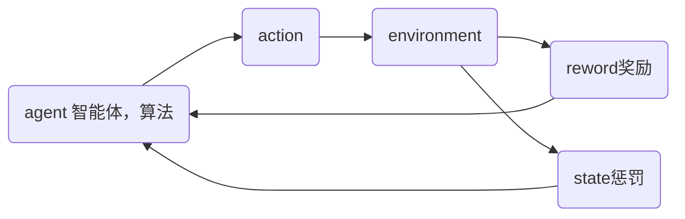
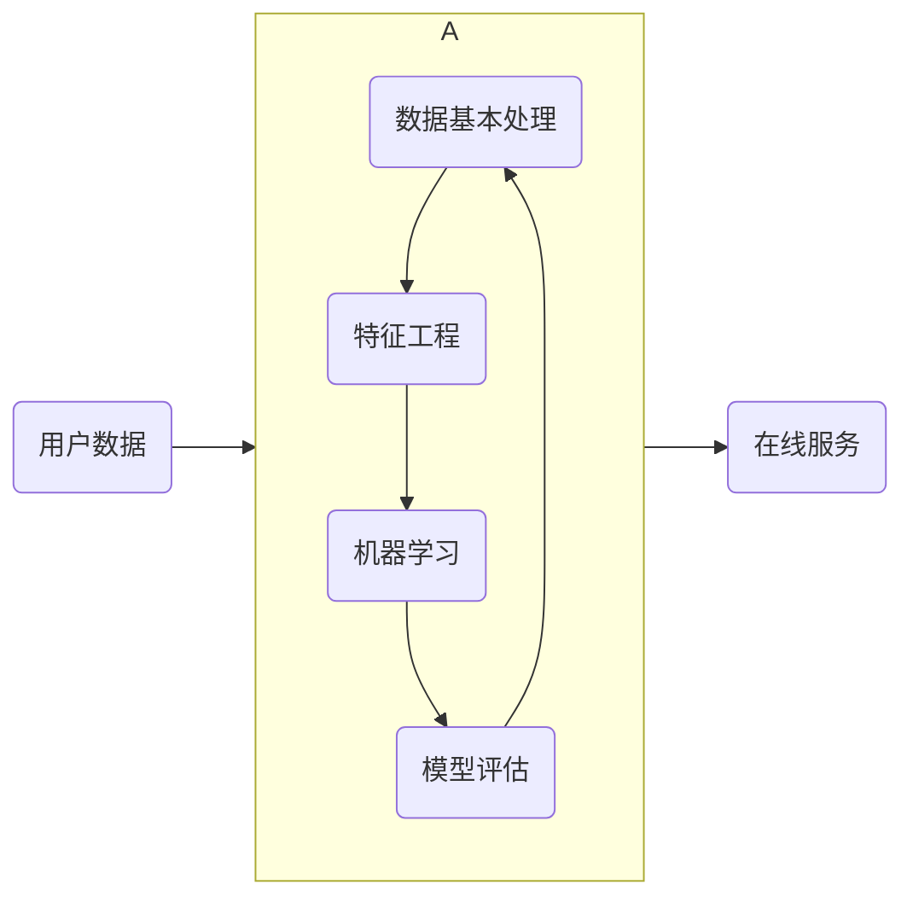

# 1. 术语
样本  
特征(x)、标签(y)  
训练集(train)、测试集(test)  
x_train、y_train、y_pred  
x_test、y_test  

# 2. 算法分类

## 2.1 有监督学习：  
训练集有特征有标签  
分类问题  标签非连续  
回归问题  标签连续  

## 2.2 无监督学习  
训练集有特征无标签，对样本间的相似性对样本进行聚类等，发现事物内部结构及相互关系  
聚类问题  

## 2.3 半监督     
训练集有特征，部分有标签，部分无标签  

### 2.3.1 工作原理
1. 先让专家对训练集样本打标签，利用这部分样本，训练出一个**模型**  
2. 利用该模型给未打标签的测试集样本生成标签（预测结果）  
3. 让专家审核结果  
 
## 2.4 强化学习
训练模型根据环境获取最大奖励  


# 3. 建模流程


  
## 3.1 数据基本处理:  
### 3.1.1 数据缺失值处理
### 3.1.2 异常值处理  
### 3.1.3 划分训练集与测试集
一般是将数据集划分为2-8或者3-7比例  
## 3.2 特征工程：  
略，见下述4部分详解。  
特征提取，特征预处理，特征降维    

## 3.3 机器学习(模型训练) 
线性回归  
逻辑回归  
决策树  
CBDT  

## 3.4 模型评估  
### 3.4.1 回归评测指标  
### 3.4.2 分类评测指标
**方式1：model.score()**
```python
# 方式1：基于 训练集的特征 和 训练集的标签   进行评分
print("model.score 训练集 正确率(准确率):\n", model.score(x_train, y_train))
# 方式1：基于 测试集的特征 和 测试集的标签   进行评分
print("model.score 测试集 正确率(准确率):\n", model.score(x_test, y_test))
```
**方式2：accuracy_score()**
```python
# 方式1：基于 测试集的标签 和 预测结果      进行评分
print("accuracy_score 正确率(准确率):\n", accuracy_score(y_test, y_predict))
```
### 3.4.3 聚类评测指标  
## 3.5 模型调优
### 3.5.1 交叉验证

用于模型选择和调参  

**1) 核心思想**：  
将数据集多次划分成训练集和验证集，多次训练和验证模型，从而更全面、更稳定地评估模型的泛化能力。  

**2) 为什么需要交叉验证？**
在建模过程中，我们通常会将数据分为训练集和测试集。训练集用来训练模型，测试集用来评估模型在未知数据上的表现。但这种方法存在一个问题：测试集的划分具有随机性，可能影响评估结果的稳定性。  

例如，如果测试集中恰好全是容易预测的样本，那么模型的评估结果就会偏高；反之则偏低。这会导致我们对模型性能的判断不准确。  

交叉验证通过多次划分数据，多次训练和验证模型，可以有效减少这种随机性带来的误差，从而得到更可靠的模型评估结果。  

**3) 简单交叉验证**  

**4) K折交叉验证**   
将训练集划分为 n 份,拿一份做验证集(测试集)、其他n-1份做训练集的。  

验证原理:  
将数据集划分为 cv=4 份  
1. 第一次:把第一份数据做验证集,其他数据做训练的  
2. 第二次:把第二份数据做验证集,其他数据做训练的  
3.	....,以此类推,总共训练4次,评估4次。    
4. 使用训练集+验证集多次评估模型,取平均值做交叉验证为模型得分  
5.若k=5模型得分最好,再使用全部训练集(训练集+验证集)对k=5模型再训练一遍,再使用测试集对k=5模型做评估。  

**5) 留一交叉验证**  

### 3.5.2 网格化搜索
**是什么？**  
网格搜索（Grid Search）是一种在机器学习中用于自动寻找模型最佳参数组合的方法。它的核心思想是：在给定的参数范围内，穷举所有可能的参数组合，然后选择在验证集上表现最好的那一组参数。  

**为什么需要网格搜索？**  
在训练模型时，模型通常有一些**超参数（Hyperparameters）**，这些参数不是通过训练得到的，而是需要我们手动设置的。例如：  
决策树的 max_depth  
随机森林的 n_estimators  
支持向量机的 C 和 gamma  
KNN 的 n_neighbors  
不同的参数组合会导致模型性能差异很大。如果我们手动尝试所有可能的组合，效率非常低。网格搜索可以自动完成这个过程，帮助我们找到最优的参数组合。  

**网格搜索的原理**  
定义**参数网格**：列出每个超参数的可能取值。  
交叉验证：对每组参数组合，使用**交叉验证**评估模型性能。   
选择最佳参数：选择在交叉验证中表现最好的那一组参数。  
### 3.5.3 sklearn测试
**测试代码**
```python
import pandas as pd
from sklearn.datasets import load_iris
from sklearn.metrics import accuracy_score
from sklearn.model_selection import train_test_split, GridSearchCV
from sklearn.neighbors import KNeighborsClassifier
from sklearn.preprocessing import StandardScaler


def iris_evaluate_test():
    # 1. 加载数据集
    iris_dataset = load_iris()

    # 2. 数据预处理
    x_train, x_test, y_train, y_test = train_test_split(
        iris_dataset.data,
        iris_dataset.target,
        test_size=0.3,
        random_state=23
    )
    print("测试集的target：\n", y_test)

    # 3. 特征工程
    # 3.1 特征提取： 略
    # 3.2 特征预处理：
    scaler = StandardScaler()
    # 部分数据先拟合fit，找到该part的整体指标，如均值、方差、最大值最小值等等（根据具体转换的目的），然后对该trainData进行转换transform，从而实现数据的标准化、归一化等等。
    x_train = scaler.fit_transform(x_train)
    # 在fit的基础上，进行标准化，降维，归一化等操作
    x_test = scaler.transform(x_test)

    # 4. 模型训练
    # 4.1 创建模型
    model = KNeighborsClassifier(weights='uniform')
    # 4.2 定义网格化参数
    param_grid = {'n_neighbors': [1, 3, 5, 7, 11, 13, 15]}
    model = GridSearchCV(estimator=model, param_grid=param_grid, cv=5)
    # 4.3 训练模型
    model.fit(x_train, y_train)
    # 4.4 交叉验证网格化搜索结果查看
    print("model.best_score_:\n", model.best_score_)
    print("model.best_estimator_:\n", model.best_estimator_)
    print("model.best_params_:\n", model.best_params_)
    print("model.cv_results_:\n", model.cv_results_)
    # 4.5 保存交叉验证结果集
    my_cv_result = pd.DataFrame(model.cv_results_)
    my_cv_result.to_csv(path_or_buf='./my_cv_result.csv')
    # 4.6 更新模型为最新模型
    model = model.best_estimator_
    model.fit(x_train, y_train)

    # 5. 模型预测
    # 5.1 对30条测试集进行预测
    y_predict = model.predict(x_test)
    print("测试集的预测target：\n", y_predict)

    # 6. 模型评估
    # 基于 测试集的标签 和 预测结果      进行评分
    print("accuracy_score 正确率(准确率):\n", accuracy_score(y_test, y_predict))


if __name__ == '__main__':
    iris_evaluate_test()
```
**测试结果**
```text
测试集的target：
 [2 2 1 0 2 1 0 2 0 1 1 0 2 0 0 2 1 1 2 0 2 0 0 0 2 0 0 2 1 1 0 1 0 2 0 0 1
 1 1 2 2 0 1 0 1]
 
model.best_score_:
 0.9619047619047618

model.best_estimator_:
 KNeighborsClassifier(n_neighbors=7)

model.best_params_:
 {'n_neighbors': 7}

model.cv_results_:
{
'mean_fit_time': array([0.00079746, 0.00019941, 0.        , 0.00019941]), 
'std_fit_time': array([0.00074596, 0.00039883, 0.        , 0.00039883]), 
'mean_score_time': array([0.00179558, 0.0010087 , 0.00099659, 0.002213  ]), 
'std_score_time': array([7.48598976e-04, 2.25919186e-05, 2.61174468e-07, 9.84770248e-04]), 
'param_n_neighbors': masked_array(data=[1, 3, 5, 7],mask=[False, False, False, False],fill_value=999999), 
'params': [{'n_neighbors': 1}, {'n_neighbors': 3}, {'n_neighbors': 5}, {'n_neighbors': 7}], 
'split0_test_score': array([0.9047619 , 0.85714286, 0.9047619 , 0.95238095]), 
'split1_test_score': array([0.9047619 , 0.9047619 , 0.9047619 , 0.95238095]), 
'split2_test_score': array([0.9047619 , 0.9047619 , 0.95238095, 0.95238095]), 
'split3_test_score': array([1.        , 0.95238095, 0.95238095, 1.        ]), 
'split4_test_score': array([0.95238095, 0.95238095, 0.95238095, 0.95238095]), 
'mean_test_score': array([0.93333333, 0.91428571, 0.93333333, 0.96190476]), 
'std_test_score': array([0.03809524, 0.03563483, 0.02332847, 0.01904762]), 
'rank_test_score': array([2, 4, 2, 1])
}
```
# 4. 特征工程

## 4.1 特征提取

## 4.2 特征预处理：
### 4.2.1 为什么要做预处理？
避免由于量纲导致有些特征对目标结果影响过大，导致模型算法无法学习到其他特征  

### 4.2.2 归一化：  
x' = (当前值-当前特征列最小值)/(当前特征列最大值-当前特征列最小值)  

如果要把数据映射到【mi，mx】范围上，则公式如下：  
x'' = x' * (mx-mi) + mi  

**优缺点**
最大值和最小值容易受异常点的影响，鲁棒性较差  

**测试用例**
```python
from sklearn.preprocessing import MinMaxScaler

x_train = [
    [90, 2, 10, 40],
    [60, 4, 15, 45],
    [75, 3, 13, 46]
]

# feature_range默认0-1，可以不写
scaler = MinMaxScaler(feature_range=(0, 1))

x_train_new = scaler.fit_transform(x_train)

print(x_train_new)
```
**测试结果**
```text
[[1.         0.         0.         0.        ]
 [0.         1.         1.         0.83333333]
 [0.5        0.5        0.6        1.        ]]
```

### 4.2.3 标准化：
x' = (x-mean)/σ   
mean:特征均值    
σ：特征标准差  

**优缺点**

少量异常点对均值影响不大，适合大量嘈杂数据  

**测试用例**
```python
from sklearn.preprocessing import StandardScaler

x_train = [
    [90, 2, 10, 40],
    [60, 4, 15, 45],
    [75, 3, 13, 46]
]

scaler = StandardScaler()

x_train_new = scaler.fit_transform(x_train)

print(x_train_new)

print("均值:",scaler.mean_)

# (该列每个值和该列平均值的差) 的平方和 的平均值
print("方差:",scaler.var_)

# 方差开根号
print("标准差:",scaler.scale_)
```

**测试结果**
```text
[[ 1.22474487 -1.22474487 -1.29777137 -1.3970014 ]
 [-1.22474487  1.22474487  1.13554995  0.50800051]
 [ 0.          0.          0.16222142  0.88900089]]
均值: [75.          3.         12.66666667 43.66666667]
方差: [150.           0.66666667   4.22222222   6.88888889]
标准差: [12.24744871  0.81649658  2.05480467  2.62466929]
```


## 4.3 特征降维

## 4.4 特征选择
从提取出的特征中，选择一个特征集合子集，不改变原数据  

## 4.5 特征组合
将多个特征通过乘法，加法等运算进行合并成一个特征  

# 5. 模型拟合问题
TODO 曲线图  

## 5.1 拟合
模型对样本点的拟合情况  
模型在训练集合测试集的表现情况  

## 5.2 欠拟合  under-fitting
模型在训练集和测试集表现都不好  

### 5.2.1 原因  
训练集数据单一。模型学习到的特征太少，过于简单  

## 5.3 过拟合  over-fitting
模型在训练集表现好，在测试集表现不好  

### 5.3.1 原因 
数据不纯，训练数据太少。模型学习到的特征过多，过于复杂   

## 5.4 泛化
模型在新样本集(如测试集)上表现好坏的能力  

**奥卡姆剃刀原则：**
两个具有相同泛化误差的模型，较简单的模型比复杂的模型更好  

# 6. sklearn
https://scikit-learn.org/stable/  
