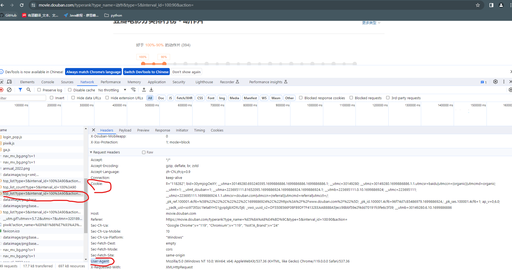

# PythonLearning
PythonLearning
## Spider
### urllib
https://docs.python.org/3/library/urllib.request.html#module-urllib.request
#### urllib.request
##### urllib.request.urlopen(url, data=None, [timeout, ]*, cafile=None, capath=None, cadefault=False, context=None)
##### get请求
demo
```python
import json
from urllib import request

import pandas
url = 'https://movie.douban.com/j/chart/top_list?type=5&interval_id=100%3A90&action=&start=0&limit=1000'
headers = {
    "Cookie": "xxx",
    "User-Agent": "xx"
}
# request.Request
req = request.Request(url=url, headers=headers)
# urlopen
response = request.urlopen(req)
# response.read()
content = response.read().decode('utf-8')
# transfer to obj
obj = json.loads(content)
# transfer to pd
df = pandas.DataFrame(obj)
# 持久化
df.to_excel(pandas.ExcelWriter("douban_action_movies.xlsx"), engine="xlsxwriter")
```
Cookie和UA的获取:
